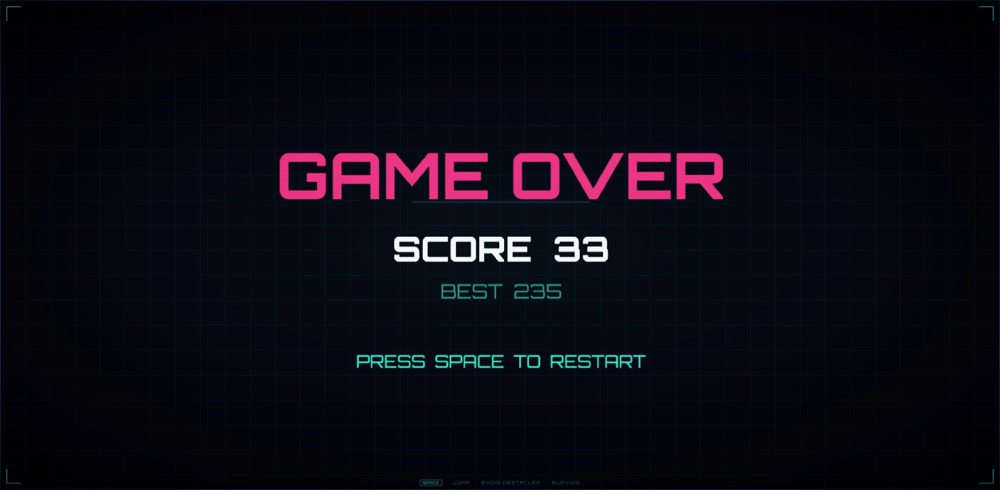

# Neon Runner

A browser-based arcade game built with [Excalibur.js](https://excaliburjs.com). Jump over obstacles, survive as long as possible, and chase a high score as the neon cityscape accelerates around you.

  

<div align="center">
  
</div>

---

## Gameplay

- **Jump** over incoming obstacles using `Space` or `↑`
- Speed increases every 3 seconds — survive as long as you can
- Score accumulates over time; every 100 points triggers an audio cue
- Hit an obstacle → screen shake, game over, restart with `Space` or `Enter`

---

## What's New

**Performance optimizations:**
- Eliminated per-frame allocations in parallax and obstacle systems
- GPU-accelerated CSS overlay layers
- Cached `AudioContext.currentTime` in sound methods
- Guarded score label updates to skip unnecessary redraws
- Optimized camera shake reset (single call instead of per-frame check)

**Bug fixes:**
- AudioContext now resumes on first interaction (fixes silent audio in Chrome)
- Obstacle gaps scale with speed so obstacles stay clearable at max difficulty
- Game freezes player and obstacles during death shake (no ghost movement)
- Scene transition syncs with shake completion for clean handoff
- Time-based input cooldown on restart prevents ghost jumps
- Score passes correctly from `GameScene` to `GameOverScene`
- Replaced `setTimeout` with engine-time timer to prevent drift

---

## Tech Stack

| Tool | Role |
|------|------|
| [Excalibur.js](https://excaliburjs.com) v0.32 | 2D game engine (actors, physics, scenes, input) |
| TypeScript 5.9 | Type-safe game logic |
| Vite 8 | Dev server + production build |
| Vitest 4 | Unit tests |
| Web Audio API | Synthesized sound effects (no audio assets) |

---

## Getting Started

```bash
npm install
npm run dev
```

Open [http://localhost:5173](http://localhost:5173) in your browser.

### Other Commands

```bash
npm run build    # production build → dist/
npm run preview  # serve the production build locally
npm test         # run unit tests
```

---

## Project Structure

```
src/
├── main.ts                    # Engine init, scene registration
├── config.ts                  # All game constants (speeds, colors, physics)
├── actors/
│   ├── Player.ts              # Jump mechanics, ground detection, input cooldown
│   ├── Obstacle.ts            # Randomly-sized obstacles
│   ├── Ground.ts              # Static collision platform
│   └── ParallaxBackground.ts  # 3-layer depth scrolling
├── scenes/
│   ├── GameScene.ts           # Main loop: score, speed scaling, collision
│   └── GameOverScene.ts       # End screen + restart listener
├── systems/
│   └── ObstacleSpawner.ts     # Procedural spawning with random gaps
└── audio/
    └── SoundManager.ts        # Synthesized jump / game-over / score sounds
```

---

## Configuration

All tunable constants live in [`src/config.ts`](src/config.ts):

| Constant | Default | Description |
|----------|---------|-------------|
| `initialSpeed` | `300` px/s | Starting scroll speed |
| `maxSpeed` | `800` px/s | Speed cap |
| `speedIncrement` | `+20` | Added every 3 seconds |
| `jumpForce` | `-700` | Upward velocity on jump |
| `gravity` | `1800` | Downward acceleration |
| `minObstacleGap` | `300` px | Minimum gap between obstacles |
| `maxObstacleGap` | `600` px | Maximum gap between obstacles |

---

## License

MIT
